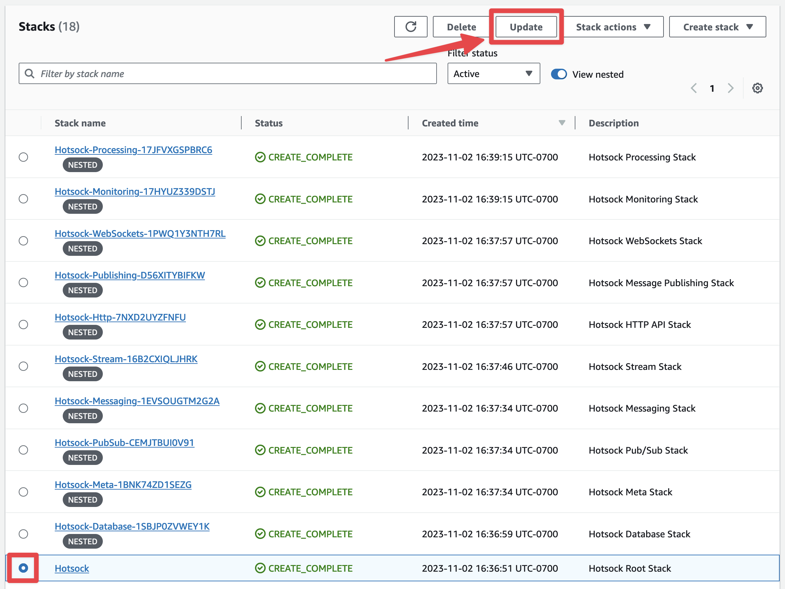
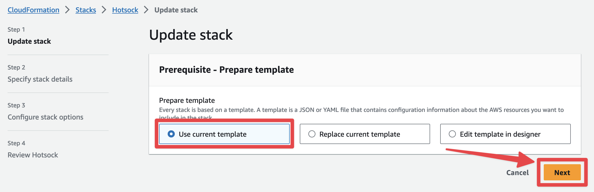
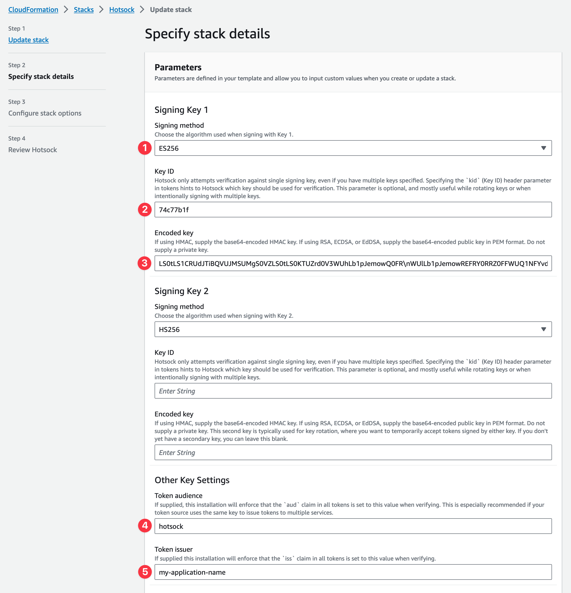
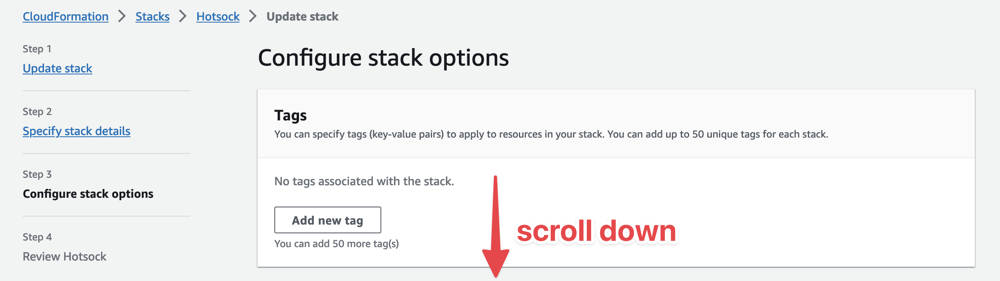

# Authentication 🔐

Hotsock uses [JSON Web Tokens (JWT)](https://jwt.io/) to authenticate WebSocket connections and authorize permissions once connected. This way, your existing application can sign customer-specific tokens and your client applications can pass that token to Hotsock without it needing to know anything about your application.

A decoded token might look something like this.

```json
{
  "alg": "HS256",
  "typ": "JWT"
}
{
  "aud": "hotsock",
  "exp": 1686011549,
  "channels": {
    "user.123": {
      "subscribe": true
    }
  },
  "scope": "connect"
}
```

The top section containing `alg` and `typ` are the token headers. `typ` must be "JWT" and `alg` must be the algorithm used during signing. Any JWT generation library will handle this for you by default.

## Signing methods

Hotsock can verify tokens signed using any of the following methods.

- [HMAC](https://datatracker.ietf.org/doc/html/rfc7518#section-3.2) (HS256, HS384, HS512)
- [RSA](https://datatracker.ietf.org/doc/html/rfc7518#section-3.3) (RS256, RS384, RS512)
- [RSASSA-PSS](https://datatracker.ietf.org/doc/html/rfc7518#section-3.5) (PS256, PS384, PS512)
- [ECDSA](https://datatracker.ietf.org/doc/html/rfc7518#section-3.4) (ES256, ES384, ES512)
- [EdDSA](https://datatracker.ietf.org/doc/html/rfc8037#section-3.1)

## Choose a signing method

If you're evaluating or trying things out for the first time, start with HMAC (HS256). HMAC uses a single secret key (can be any string value) for both signing and verification. Once you're ready to sign tokens for a production workload, consider an asymmetric option so Hotsock never has the private secret (nor do other tools verifying your tokens).

Single key or "symmetric" signing methods work well when both producers and consumers of tokens are trusted, or even the same system. Since the same secret is used to both sign and validate tokens, you can't safely distribute the key for validation by other, potentially untrusted systems.

Asymmetric signing methods, such as ECDSA and RSA, use separate keys for signing and verifying tokens. This makes it possible to issue tokens with a private key, and freely allow _any_ consumer to access the public key and use it for verifying tokens. Since Hotsock is a separate system, an asymmetric signing method is ideal because it only ever verifies tokens &mdash; it never issues them.

## Set signing method in Hotsock

Once you've chosen a signing method and have either the asymmetric keypair or a symmetric shared key, you'll need to configure Hotsock to use it for token verification.

### HMAC

If you've chosen HMAC, you'll need to Base64 encode your chosen raw shared key value. If, for example, the secret key is `bazinga`, the Base64 encoded value is `YmF6aW5nYQ==`. Make sure you generate your own secret, ensure it has plenty of entropy, and don't actually use bazinga!

### RSA / ECDSA / EdDSA

If you've chosen one of the asymmetric options, **you'll need to Base64 encode the PEM-formatted public key**. Do not supply the private key! Use the private key to sign tokens in your backend and keep it secret!

#### Generate a secure signing key

You can generate a new private key using OpenSSL. **Do not use these keys. Generate your own.**

```
openssl ecparam -name prime256v1 -genkey -noout -out hotsock-private.pem
```

Now derive the public key from the private key.

```
openssl ec -in hotsock-private.pem -pubout -out hotsock-public.pem
```

Base64 encode the public key.

```
base64 -i hotsock-public.pem
```

Given the following PEM-formatted public key:

```
-----BEGIN PUBLIC KEY-----
MFkwEwYHKoZIzj0CAQYIKoZIzj0DAQcDQgAEYD54V/vp+54P9DXarYqx4MPcm+HK
RIQzNasYSoRQHQ/6S6Ps8tpMcT+KvIIC8W/e9k0W7Cm72M1P9jU7SLf/vg==
-----END PUBLIC KEY-----
```

The Base64 encoded value is:

```
LS0tLS1CRUdJTiBQVUJMSUMgS0VZLS0tLS0KTUZrd0V3WUhLb1pJemowQ0FR\nWUlLb1pJemowREFRY0RRZ0FFWUQ1NFYvdnArNTRQOURYYXJZcXg0TVBjbStI\nSwpSSVF6TmFzWVNvUlFIUS82UzZQczh0cE1jVCtLdklJQzhXL2U5azBXN0Nt\nNzJNMVA5alU3U0xmL3ZnPT0KLS0tLS1FTkQgUFVCTElDIEtFWS0tLS0t
```

:::warning
Base64 is an _encoding_, it is **not** a form of _encryption_. When you paste an encoded HMAC shared key into CloudFormation, that value can easily be decoded back to its string value by anyone with access to CloudFormation or Lambda in the installed AWS account.

This is yet another reason why asymmetric key options are recommended. Passing around a shared HMAC secret has risks, but sharing a public key is harmless!
:::

### Update the stack

Open the AWS CloudFormation console in the account and region where you installed Hotsock. Click on the root Hotsock stack and click the "Update" button.



You'll be prompted with the "Prepare template" screen and can keep "Use current template" selected and click "Next".



1. For the "Signing Key 1 - Signing method" (`SigningKey1MethodParameter` via CLI) parameter, choose your desired signing method. Ensure that the SHA algorithm (256, 384, or 512) matches what is set by your token issuer. You can verify this by inspecting the `alg` value in the header portion of an issued JWT.

1. If your token issuer sets a `kid` header for this key, set "Signing Key 1 - Key ID" (`SigningKey1IDParameter` via CLI) to this value. Otherwise leave it blank. If specified, JWTs signed with this key must include the `kid` header matching this value.

1. For the "Signing Key 1 - Encoded key" (`SigningKey1EncodedParameter` via CLI) parameter, paste the Base64 encoded value you calculated in the previous step.

1. We recommend setting "Other Key Settings - Token audience" (`TokenAudienceParameter` via CLI), but it is not required. `hotsock` or `hotsock-eu-west-1` (your installation's region) are reasonable values here, and if set, all signed JWTs must include the `aud` claim set to the value specified in this parameter. This ensures that valid tokens signed for other services with the same private key cannot be unexpectedly used as a Hotsock token.

1. We recommend setting "Other Key Settings - Token issuer" (`TokenIssuerParameter` via CLI), but it is not required. `my-application-name` (your application) is a reasonable values here, and if set, all signed JWTs must include the `iss` claim set to the value specified in this parameter.

You can typically leave all `Signing Key 2*` parameters blank. Those secondary key parameters are for zero-downtime key rotation.



Once `SigningKey1EncodedParameter` and `SigningKey1MethodParameter` (at least) are set in the console, click "Next" at the bottom.


No changes are required on the "Configure Stack Options" screen. Scroll down and click "Next" at the bottom.




Lastly on the "Review Hotsock" screen, check the boxes in the "Capabilities" section and click "Submit" at the bottom.

Once the stack update completes, you can immediately begin using tokens issued with this key for this Hotsock installation.

## Issuing tokens

Implementations of JWT signing and issuing vary depending on the needs of your application, programming language choice, framework, client device, etc.

If you want a pre-built JWT signing and issuing solution that also runs in your AWS account, check out our [jwt-issuer](https://github.com/hotsock/jwt-issuer) as a companion to Hotsock. Installation takes just a few minutes, there's nothing for you to manage, it helps keep your key secure, and it's open source and MIT-licensed.

If you're using Ruby, we also have the [hotsock-ruby](https://github.com/hotsock/hotsock-ruby) gem that takes care of issuing tokens with a locally-specified key.

Additional Hotsock libraries for various languages are coming soon.

For development and testing of token signing, [JWT Web Tool](https://dinochiesa.github.io/jwt/) is fantastic and JWT.io has a [comprehensive list of signing libraries](https://jwt.io/libraries) available.

Each installation also includes a handy [web console](../server-api/web-console.mdx) where you can ensure issued tokens work as expected. Grab the URL from the [WebConsoleHttpUrl](../installation/initial-setup.mdx#WebConsoleHttpUrl) stack output and paste a valid token to connect.

Once you're able to sign tokens and have the Hotsock stack configured for your signing method, you'll want to [add some claims](./claims.mdx).
