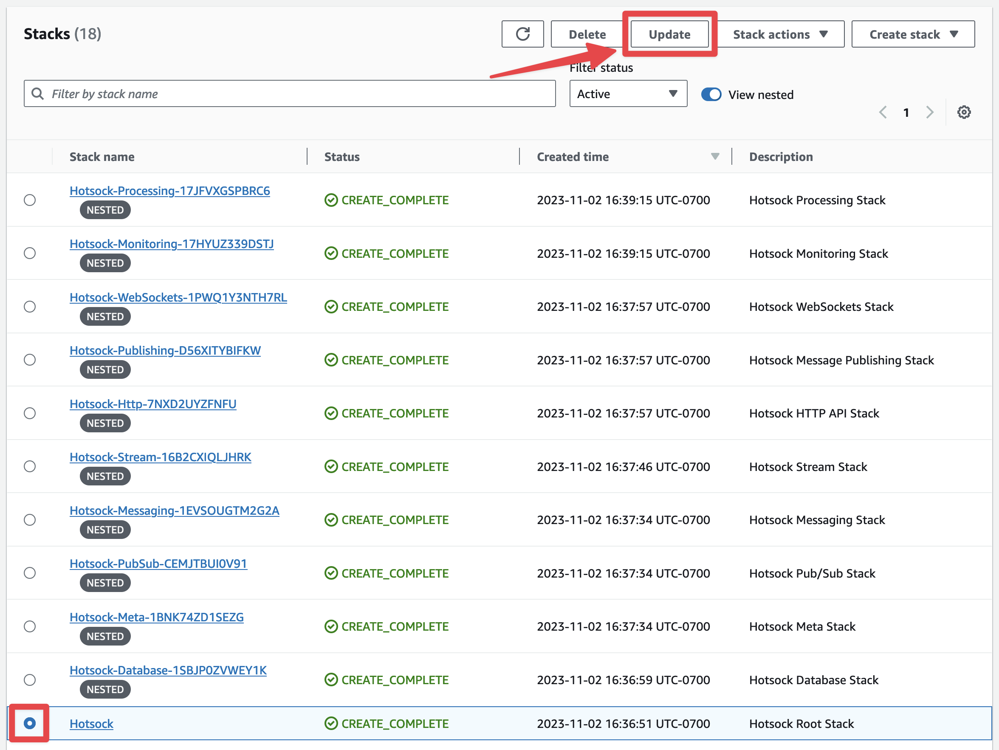

# Custom Domains

When you create a Hotsock installation, the default WebSockets URL your clients need to use looks something like `wss://1ycut2oy9h.execute-api.us-east-1.amazonaws.com/v1/`. You can customize this by using a subdomain on a domain you already own, allowing your clients to use something like `wss://real-time.example.com` instead.

## Request and verify a certificate

Before you can use your domain, you must request a certificate and verify ownership of your domain.

1. Sign into the AWS Console as an administrator user or role.
1. Using the region switcher in the top navigation, switch to the same AWS region where your Hotsock installation is configured.
1. In the main AWS Console search bar, search for "Certificate Manager" and choose the top result.
1. Click "Request" in the top right.
1. Keep the default "Request a public certificate" and click "Next".
1. Enter the desired subdomain on the domain you own in the "Fully qualified domain name" field. Example: `real-time.example.com`, assuming you own `example.com`.
1. Validation method: "DNS validation".
1. Key algorithm: "RSA 2048"
1. Tags: up to you!
1. Click "Request".

You'll see a "Successfully request certificate with ID ..." message on top. Click the "View certificate" button to the right of that message. [Follow this AWS guide](https://docs.aws.amazon.com/acm/latest/userguide/dns-validation.html) for validating the certificate with DNS.

Once DNS validation is complete and the certificate shows as "Issued", click the "copy" button next to the "ARN" and move on to the next section.


## Update your Hotsock installation

Sign into your AWS account as a principal with administrative permissions and open the CloudFormation console. Find the root Hotsock stack and click on its radio button. There are many Hotsock stacks marked as "nested", you'll want to ignore those and find the root stack that is _not_ marked as nested.

In the upper-right, click the "Update" button. Conveniently, if you accidentally try and update a nested stack, it will suggest that you instead go to the root stack.



You'll be prompted with the "Prepare template" screen and can keep "Use current template" selected and click "Next".


On the "Specify stack details" screen, you can configure **"WebSockets custom domain name"** and **"WebSockets custom domain ACM certificate ARN"**.

Enter the subdomain you entered for the "Fully qualified domain name" when configuring the certificate and enter the ARN that you copied from the verified certificate in Certificate Manager.


Once you're satisfied with your choices, you can update the stack with these new settings.

1. Scroll to the bottom and click "Next".
1. Scroll to the bottom of the "Configure stack options" screen and click "Next".
1. Scroll to the bottom of the "Review Hotsock" screen, check all the boxes in the "Capabilities and transforms" section and click "Submit".

Once the stack update is complete, open [your stack's Outputs](./initial-setup.mdx#stack-outputs-and-endpoints) and find the values for [`WebSocketsCustomDomainRegionalDomainName`](./initial-setup.mdx#WebSocketsCustomDomainRegionalDomainName), [`WebSocketsCustomDomainRegionalHostedZoneId`](./initial-setup.mdx#WebSocketsCustomDomainRegionalHostedZoneId), and [`WebSocketsCustomDomainWssUrl`](./initial-setup.mdx#WebSocketsCustomDomainWssUrl). You'll use these to configure DNS below.

## Configure DNS

After updating your Hotsock installation, you need to configure DNS to use your custom domain for WebSockets. You can do this by setting up either an ALIAS record (for Route 53) or a CNAME record (for other DNS providers).

### Using Route 53 (ALIAS Record)

1. Sign into the AWS Management Console and open the Route 53 console.
2. In the left navigation pane, choose "Hosted zones".
3. Choose the hosted zone for the domain you want to use (e.g., example.com).
4. Click "Create record" and choose the following settings:
   - **Record name**: Enter the subdomain you specified earlier, e.g., `real-time`.
   - **Record type**: Choose `A - IPv4 address`.
   - **Alias**: Choose `Yes`.
   - **Route traffic to**: Choose `Alias to API Gateway`.
   - **Region**: Choose the same region as your Hotsock installation.
   - **API Gateway**: Choose `Regional` and then select the domain name for your WebSocket API from the drop-down list (e.g., `d-zv7jqttrkl.execute-api.us-east-1.amazonaws.com`). The console automatically populates the Hosted Zone ID, so you won't need that unless you're creating an ALIAS record using the Route53 SDK/API.
5. Click "Create records".

### Using Other DNS Providers (CNAME Record)

1. Log into the DNS management console for your domain.
2. Navigate to the DNS settings or DNS management page for your domain.
3. Create a new CNAME record with the following settings:

   - **Name**: Enter the subdomain you specified earlier, e.g., `real-time`.
   - **Type**: Choose `CNAME`.
   - **Value**: Enter the WebSocket API regional domain name (e.g., `d-zv7jqttrkl.execute-api.us-east-1.amazonaws.com`).

4. Save your changes.

### Verify DNS Configuration

After configuring DNS, you can verify that it's correctly set up:

1. Open a terminal or command prompt.
2. Use the `nslookup` or `dig` command to check the DNS records for your subdomain:

   ```bash
   nslookup real-time.example.com
   ```

   or

   ```bash
   dig real-time.example.com
   ```

You should see a response that points to a collection of IP addresses (for ALIAS records) or to your WebSocket API regional domain name (e.g., `d-zv7jqttrkl.execute-api.us-east-1.amazonaws.com` for CNAME records).

### Conclusion

Once your DNS settings are configured and propagated, your clients can connect to your WebSockets API using your custom domain (e.g., `wss://real-time.example.com`).
