# Initial Installation & Setup 🪄

Assuming you already have an AWS account ready to go, installing and configuring your stack should take less than 20 minutes.

The setup process creates two [CloudFormation stacks](https://docs.aws.amazon.com/AWSCloudFormation/latest/UserGuide/stacks.html) in your AWS account.

Each stack can be created using either the AWS CloudShell CLI (recommended) or manually in the AWS Console. Use whichever you prefer. Although this document is detailed and lengthy, installation requires running just two commands in your account! Want to jump straight to it? [Here's the first](#installer-permissions-stack-cli) and [here's the second](#main-stack-cli).

By installing Hotsock, you consent to agreeing to our [Terms of Service](/legal/terms/) and [Privacy Policy](/legal/privacy/). In addition, you acknowledge that each installation is bound by our [End User License Agreement (EULA)](/legal/eula/).

[Uninstalling](./uninstallation.mdx) is also painless if you change your mind!

## Requirements

You'll need administrator access to an AWS account. An account in your [AWS Organization](https://docs.aws.amazon.com/organizations/latest/userguide/orgs_introduction.html) dedicated to Hotsock is recommended, but not required. You'll also need to [choose an AWS region](./region-support.mdx) for the installation.

:::tip
Using a dedicated AWS account provides both **security isolation** and **billing clarity**. You can enforce the principal of least privilege by only granting access to those who need it and you'll know exactly what your Hotsock installation costs over time.
:::

## Installer Permissions Stack {#installer-permissions-stack}

Before creating the main Hotsock stack, you'll first create a stack that configures roles and a permissions policy that the main stack will use, limiting the permissions that it can have. The main Hotsock stack creates IAM roles, so having this in place puts a permissions boundary around those roles, ensuring that they cannot elevate their own permissions.

This is what's included in the Installer Permissions stack. You can also [audit its contents yourself](https://github.com/hotsock/installer-permissions/blob/main/installer-permissions.yml).

- **`HotsockInstallerRole`**: IAM role that allows CloudFormation to manage Hotsock installations with appropriate permissions. It grants IAM role and policy management permissions within the `/hotsock/` IAM path and grants permissions in the `HotsockMaximumPermissions` managed policy described below.
- **`HotsockSupportRole`**: IAM role that can allow Hotsock support staff to access your account to triage issues upon your request. **Access is denied by default** with an expired date condition in the assume role trust relationship, which must be set to a date in the future to grant access.
- **`HotsockLicensingRole`**: IAM role that allows Hotsock to perform licensing operations and collect usage data for installation metering.
- **`HotsockMaximumPermissions`**: IAM managed policy that specifies the maximum permissions needed for Hotsock, used to grant permissions to `HotsockInstallerRole` and `HotsockSupportRole` and used as the mandatory [Permissions Boundary](https://docs.aws.amazon.com/IAM/latest/UserGuide/access_policies_boundaries.html) for all roles created by `HotsockInstallerRole`.

Each Hotsock role created by the installer is granted the minimal (least-privilege) permissions it actually needs and is _also_ wrapped by the permissions boundary policy, which acts as a guardrail that ensures those roles can never be granted access to anything beyond what is allowed by the boundary policy.

You can further limit permissions using [Service Control Policies (SCPs)](https://docs.aws.amazon.com/organizations/latest/userguide/orgs_manage_policies_scps.html) in your AWS Organization, but do so with caution - it could cause Hotsock functionality to break or cause the installation to fail. May be worth opening a support ticket to confirm your SCP won't cause issues.

:::caution
If you have or plan to have multiple Hotsock installations in the same AWS account, you'll only want a single installer permissions stack. Attempts to configure additional installer permissions stacks in the same account will result in CloudFormation errors caused by resource naming collisions.
:::

### Command line installation {#installer-permissions-stack-cli}

Create the Installer Permissions stack using the AWS CLI from [AWS CloudShell](https://docs.aws.amazon.com/cloudshell/latest/userguide/welcome.html) using the following steps.

1. Sign into your AWS account as an administrator user or role.
1. Switch to the desired (and [supported](./region-support.mdx)) AWS region using the region switcher in the top navigation.
1. Click the CloudShell icon in the top navigation bar or footer bar in the AWS Console.
1. Copy/paste and run the following command. Feel free to change the `--stack-name` value if you have other stack naming conventions, but keep other parameters as they are.

```
aws cloudformation create-stack \
  --stack-name HotsockInstallerPermissions \
  --template-url https://hotsock-stack-templates-us-west-2.s3.us-west-2.amazonaws.com/installer-permissions.yml \
  --capabilities CAPABILITY_NAMED_IAM \
  --tags Key=hotsock:service,Value=Hotsock
```

Here's an example that copies and pastes the above command into CloudShell and installs to `eu-west-1`. When successful, you'll see output similar to the following.

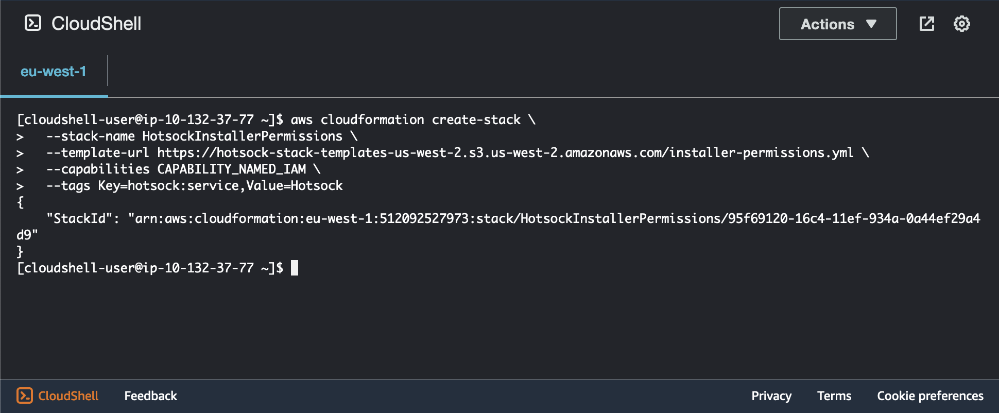

You can check the status of the stack creation by running the following command, replacing `<STACK_ID>` with the stack ID (that long `arn:aws:...` value) from the command's output. You can also see this status by opening CloudFormation in the AWS Console.

```
aws cloudformation describe-stacks \
  --stack-name <STACK_ID> \
  --query "Stacks[0].StackStatus"
```

Within a minute or so, this command will return `"CREATE_COMPLETE"` and you can move on to the [main stack CLI installation](#main-stack-cli).

### AWS Console installation {#installer-permissions-stack-console}

Configure the Installer Permissions stack in the following steps.

1. Sign into your AWS account as an administrator user or role.
1. Open the CloudFormation service console [using this link](https://console.aws.amazon.com/cloudformation/home#stacks/new?stackName=HotsockInstallerPermissions&templateURL=https://hotsock-stack-templates-us-west-2.s3.us-west-2.amazonaws.com/installer-permissions.yml), which will pre-fill the form with the CloudFormation template URL.
1. Switch to the desired installation region using the region selector in the top-right navigation. The installer permissions stack can be installed to any region, but keeping it alongside the main stack makes it easier to find in the future.

Now create the stack by clicking "Next" at the bottom of the "Prerequisite - Prepare template" screen.

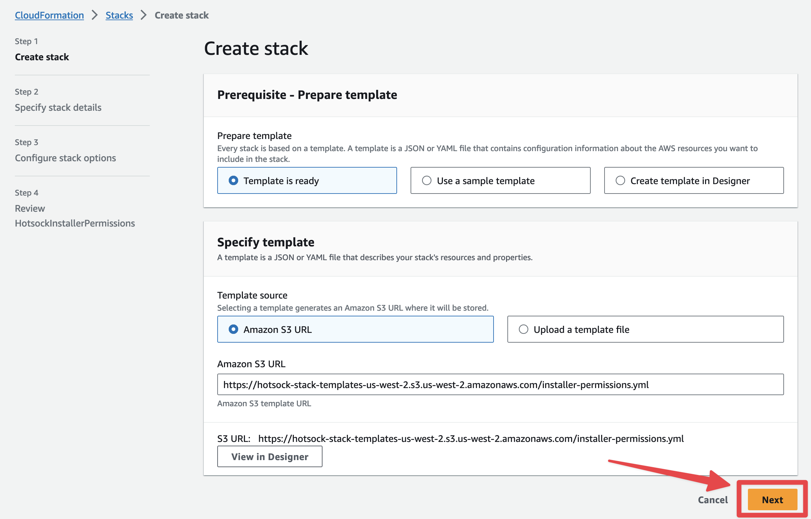

Click "Next" at the bottom of the "Specify stack details" screen.

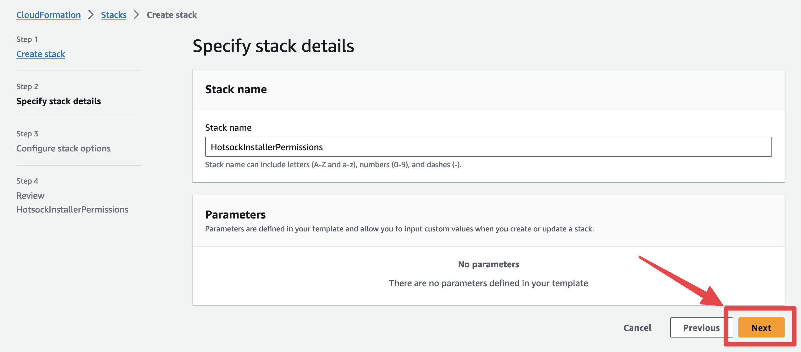

Click "Next" at the bottom of the "Configure stack options" screen.

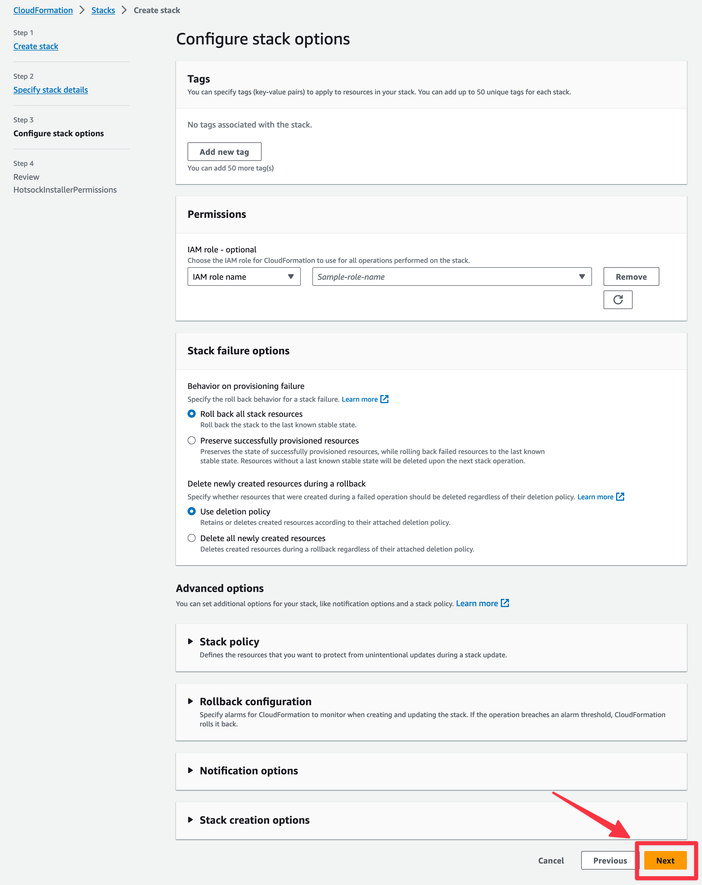

Scroll to the bottom of the "Review" screen click the "I acknowledge that AWS CloudFormation might create IAM resources with custom names" checkbox and click "Submit".

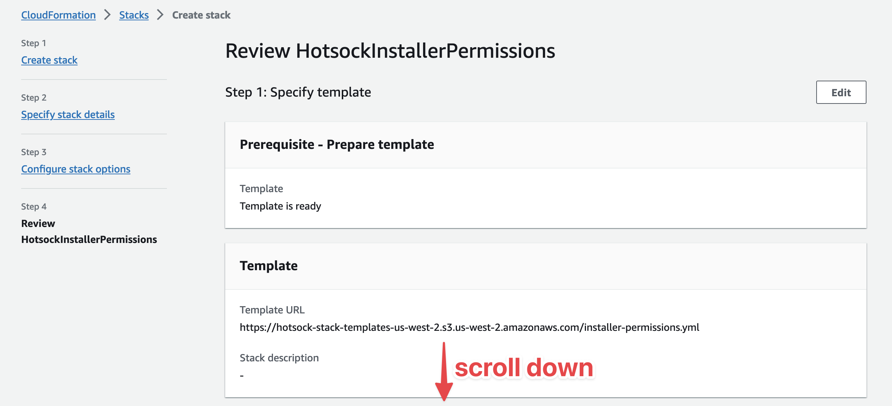
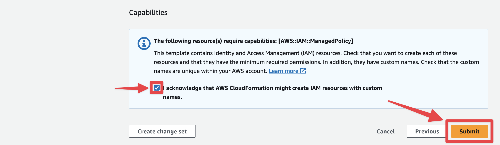

Wait for the CloudFormation stack to finish creating and indicating a `CREATE_COMPLETE` status before moving on to the next section.

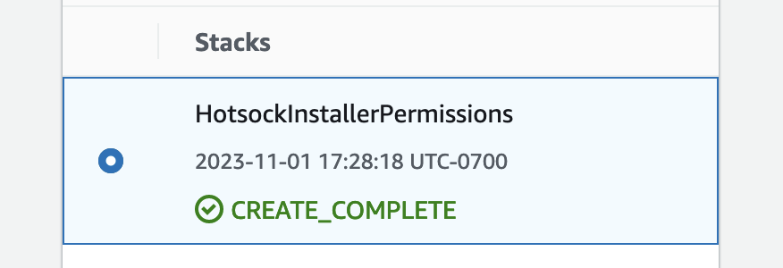

Within a minute or so, this command will return `"CREATE_COMPLETE"` and you can move on to the [main stack console installation](#main-stack-console).

## Main Hotsock Stack Installation {#main-stack}

This stack stands up a complete Hotsock application in your account. Like the installer permissions stack, you can use either a CLI command or the AWS Console.

### Command line installation {#main-stack-cli}

Create the main stack using the AWS CLI from [AWS CloudShell](https://docs.aws.amazon.com/cloudshell/latest/userguide/welcome.html) using the following steps.

1. Ensure that you have already installed the [installer permissions stack](#installer-permissions-stack-cli).
1. Sign into your AWS account as an administrator user or role.
1. Switch to the desired (and [supported](./region-support.mdx)) AWS region using the region switcher in the top navigation.
1. Click the CloudShell icon in the top navigation bar or footer bar in the AWS Console.
1. Copy/paste and run the following command. Feel free to change the `--stack-name` value if you have other stack naming conventions (keep the name short though!), but keep other parameters as they are.

```
aws cloudformation create-stack \
  --stack-name Hotsock \
  --template-url https://hotsock-stack-templates-${AWS_REGION}.s3.${AWS_REGION}.amazonaws.com/hotsock-v1.x.yml \
  --capabilities CAPABILITY_NAMED_IAM CAPABILITY_AUTO_EXPAND \
  --role-arn arn:aws:iam::$(aws sts get-caller-identity --query "Account" --output text):role/hotsock/HotsockInstallerRole \
  --tags Key=hotsock:service,Value=Hotsock
```

Here's an example that installs to `eu-west-1`. When successful, you'll see output similar to the following.

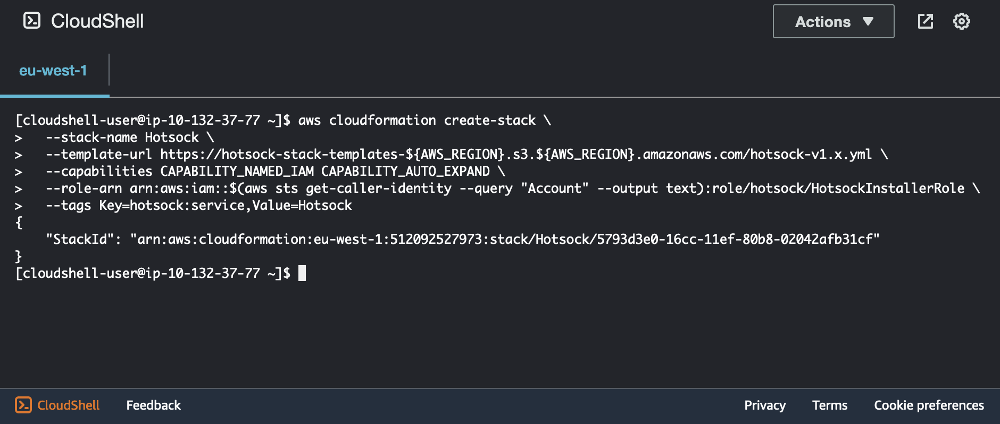

You can check the status of the stack creation by running the following command, replacing `<STACK_ID>` with the stack ID from the output above. You can also see this status by opening CloudFormation in the AWS Console.

```
aws cloudformation describe-stacks \
  --stack-name <STACK_ID> \
  --query "Stacks[0].StackStatus"
```

Within 5 minutes or so, this command will return `"CREATE_COMPLETE"` and your installation is finished.

During the creation process it will create and connect [a lot of resources](#aws-services) in your account.

Once the stack creation completes, installation was successful. Next you'll likely want to [configure Authentication](../connections/authentication.mdx).

### AWS Console installation {#main-stack-console}

1. Ensure that you have already installed the [installer permissions stack](#installer-permissions-stack-console).
1. Sign into your AWS account as an administrator user or role.
1. Click the "Launch Stack" link from the table below **for your desired region**. This will take you to a pre-filled form in the CloudFormation console.

| Region                    | Alias          |                                                                                                                URL                                                                                                                 |
| ------------------------- | -------------- | :--------------------------------------------------------------------------------------------------------------------------------------------------------------------------------------------------------------------------------: |
| US East (N. Virginia)     | us-east-1      |        [Launch Stack](https://console.aws.amazon.com/cloudformation/home?region=us-east-1#/stacks/new?stackName=Hotsock&templateURL=https://hotsock-stack-templates-us-east-1.s3.us-east-1.amazonaws.com/hotsock-v1.x.yml)         |
| US East (Ohio)            | us-east-2      |        [Launch Stack](https://console.aws.amazon.com/cloudformation/home?region=us-east-2#/stacks/new?stackName=Hotsock&templateURL=https://hotsock-stack-templates-us-east-2.s3.us-east-2.amazonaws.com/hotsock-v1.x.yml)         |
| US West (N. California)   | us-west-1      |        [Launch Stack](https://console.aws.amazon.com/cloudformation/home?region=us-west-1#/stacks/new?stackName=Hotsock&templateURL=https://hotsock-stack-templates-us-west-1.s3.us-west-1.amazonaws.com/hotsock-v1.x.yml)         |
| US West (Oregon)          | us-west-2      |        [Launch Stack](https://console.aws.amazon.com/cloudformation/home?region=us-west-2#/stacks/new?stackName=Hotsock&templateURL=https://hotsock-stack-templates-us-west-2.s3.us-west-2.amazonaws.com/hotsock-v1.x.yml)         |
| Africa (Cape Town)        | af-south-1     |       [Launch Stack](https://console.aws.amazon.com/cloudformation/home?region=af-south-1#/stacks/new?stackName=Hotsock&templateURL=https://hotsock-stack-templates-af-south-1.s3.af-south-1.amazonaws.com/hotsock-v1.x.yml)       |
| Asia Pacific (Hong Kong)  | ap-east-1      |        [Launch Stack](https://console.aws.amazon.com/cloudformation/home?region=ap-east-1#/stacks/new?stackName=Hotsock&templateURL=https://hotsock-stack-templates-ap-east-1.s3.ap-east-1.amazonaws.com/hotsock-v1.x.yml)         |
| Asia Pacific (Jakarta)    | ap-southeast-3 | [Launch Stack](https://console.aws.amazon.com/cloudformation/home?region=ap-southeast-3#/stacks/new?stackName=Hotsock&templateURL=https://hotsock-stack-templates-ap-southeast-3.s3.ap-southeast-3.amazonaws.com/hotsock-v1.x.yml) |
| Asia Pacific (Mumbai)     | ap-south-1     |       [Launch Stack](https://console.aws.amazon.com/cloudformation/home?region=ap-south-1#/stacks/new?stackName=Hotsock&templateURL=https://hotsock-stack-templates-ap-south-1.s3.ap-south-1.amazonaws.com/hotsock-v1.x.yml)       |
| Asia Pacific (Osaka)      | ap-northeast-3 | [Launch Stack](https://console.aws.amazon.com/cloudformation/home?region=ap-northeast-3#/stacks/new?stackName=Hotsock&templateURL=https://hotsock-stack-templates-ap-northeast-3.s3.ap-northeast-3.amazonaws.com/hotsock-v1.x.yml) |
| Asia Pacific (Seoul)      | ap-northeast-2 | [Launch Stack](https://console.aws.amazon.com/cloudformation/home?region=ap-northeast-2#/stacks/new?stackName=Hotsock&templateURL=https://hotsock-stack-templates-ap-northeast-2.s3.ap-northeast-2.amazonaws.com/hotsock-v1.x.yml) |
| Asia Pacific (Singapore)  | ap-southeast-1 | [Launch Stack](https://console.aws.amazon.com/cloudformation/home?region=ap-southeast-1#/stacks/new?stackName=Hotsock&templateURL=https://hotsock-stack-templates-ap-southeast-1.s3.ap-southeast-1.amazonaws.com/hotsock-v1.x.yml) |
| Asia Pacific (Sydney)     | ap-southeast-2 | [Launch Stack](https://console.aws.amazon.com/cloudformation/home?region=ap-southeast-2#/stacks/new?stackName=Hotsock&templateURL=https://hotsock-stack-templates-ap-southeast-2.s3.ap-southeast-2.amazonaws.com/hotsock-v1.x.yml) |
| Asia Pacific (Tokyo)      | ap-northeast-1 | [Launch Stack](https://console.aws.amazon.com/cloudformation/home?region=ap-northeast-1#/stacks/new?stackName=Hotsock&templateURL=https://hotsock-stack-templates-ap-northeast-1.s3.ap-northeast-1.amazonaws.com/hotsock-v1.x.yml) |
| Canada (Central)          | ca-central-1   |    [Launch Stack](https://console.aws.amazon.com/cloudformation/home?region=ca-central-1#/stacks/new?stackName=Hotsock&templateURL=https://hotsock-stack-templates-ca-central-1.s3.ca-central-1.amazonaws.com/hotsock-v1.x.yml)    |
| Europe (Frankfurt)        | eu-central-1   |    [Launch Stack](https://console.aws.amazon.com/cloudformation/home?region=eu-central-1#/stacks/new?stackName=Hotsock&templateURL=https://hotsock-stack-templates-eu-central-1.s3.eu-central-1.amazonaws.com/hotsock-v1.x.yml)    |
| Europe (Ireland)          | eu-west-1      |        [Launch Stack](https://console.aws.amazon.com/cloudformation/home?region=eu-west-1#/stacks/new?stackName=Hotsock&templateURL=https://hotsock-stack-templates-eu-west-1.s3.eu-west-1.amazonaws.com/hotsock-v1.x.yml)         |
| Europe (London)           | eu-west-2      |        [Launch Stack](https://console.aws.amazon.com/cloudformation/home?region=eu-west-2#/stacks/new?stackName=Hotsock&templateURL=https://hotsock-stack-templates-eu-west-2.s3.eu-west-2.amazonaws.com/hotsock-v1.x.yml)         |
| Europe (Milan)            | eu-south-1     |       [Launch Stack](https://console.aws.amazon.com/cloudformation/home?region=eu-south-1#/stacks/new?stackName=Hotsock&templateURL=https://hotsock-stack-templates-eu-south-1.s3.eu-south-1.amazonaws.com/hotsock-v1.x.yml)       |
| Europe (Paris)            | eu-west-3      |        [Launch Stack](https://console.aws.amazon.com/cloudformation/home?region=eu-west-3#/stacks/new?stackName=Hotsock&templateURL=https://hotsock-stack-templates-eu-west-3.s3.eu-west-3.amazonaws.com/hotsock-v1.x.yml)         |
| Europe (Stockholm)        | eu-north-1     |       [Launch Stack](https://console.aws.amazon.com/cloudformation/home?region=eu-north-1#/stacks/new?stackName=Hotsock&templateURL=https://hotsock-stack-templates-eu-north-1.s3.eu-north-1.amazonaws.com/hotsock-v1.x.yml)       |
| Middle East (Bahrain)     | me-south-1     |       [Launch Stack](https://console.aws.amazon.com/cloudformation/home?region=me-south-1#/stacks/new?stackName=Hotsock&templateURL=https://hotsock-stack-templates-me-south-1.s3.me-south-1.amazonaws.com/hotsock-v1.x.yml)       |
| South America (São Paulo) | sa-east-1      |        [Launch Stack](https://console.aws.amazon.com/cloudformation/home?region=sa-east-1#/stacks/new?stackName=Hotsock&templateURL=https://hotsock-stack-templates-sa-east-1.s3.sa-east-1.amazonaws.com/hotsock-v1.x.yml)         |

:::info
You may notice that the URLs in the `templateURL` parameter of each stack URL above cannot be accessed directly from your browser - you'll get an `AccessDenied` error if you try. This is by design - they are only meant to be accessed from within AWS by AWS services. CloudFormation accepts them as valid template URLs and can read their contents without issues.
:::

Now create the stack by clicking "Next" at the bottom of the "Prerequisite - Prepare template" screen.

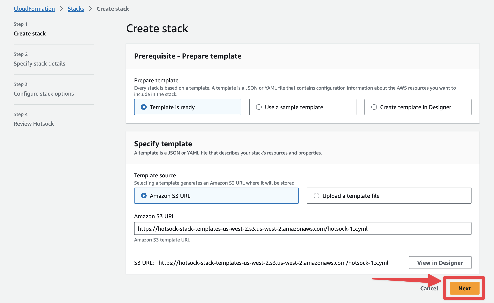

On the "Specify stack details" screen, you can leave all the parameters set to the default or blank values _for now_ and click "Next".

:::tip
In this guide we're not configuring authentication keys or event publishing. If you have the values you want to set for these parameters now, there's no harm in configuring them during initial installation. These instructions [break out configuring authentication](../connections/authentication.mdx#set-signing-method-in-hotsock) to another section.
:::

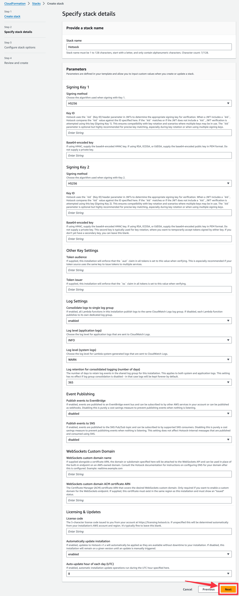

On the "Configure stack options" screen in the "Permissions" section, **switch the IAM role to "HotsockInstallerRole"**. This limits the permissions for everything in this stack to the Installer Permissions role created earlier.

Then click "Next" at the bottom.

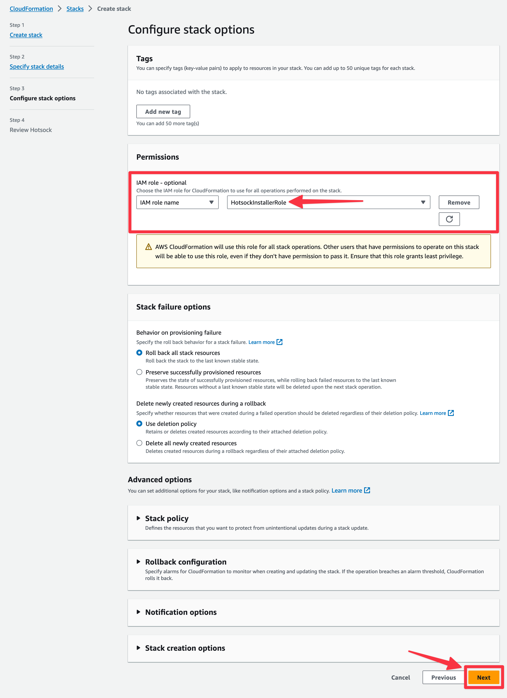

At the bottom of the "Review Hotsock" screen, check the 3 boxes in the "Capabilities and transforms" section and click "Submit".

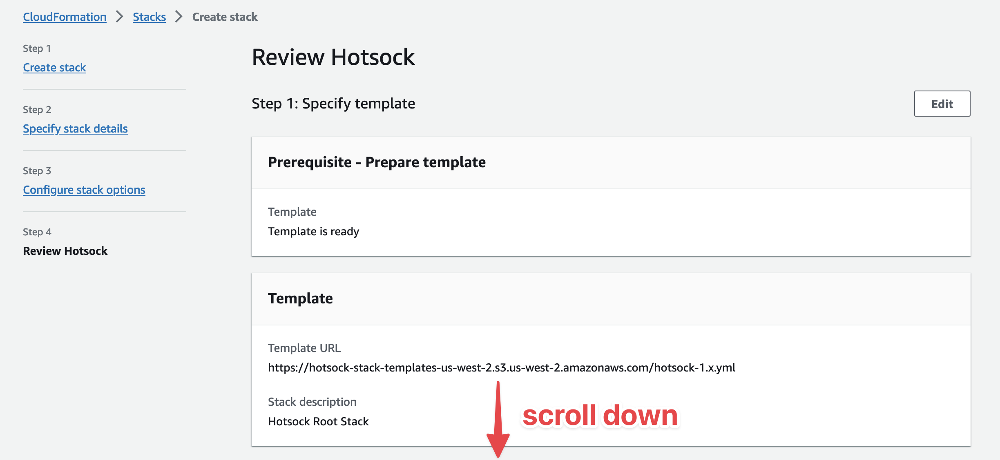
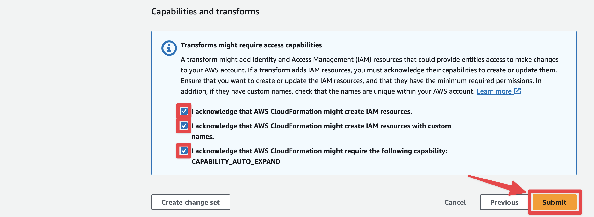

Stack creation typically takes just less than 5 minutes to complete. When the status of the root stack switches to `CREATE_COMPLETE`, it's finished.

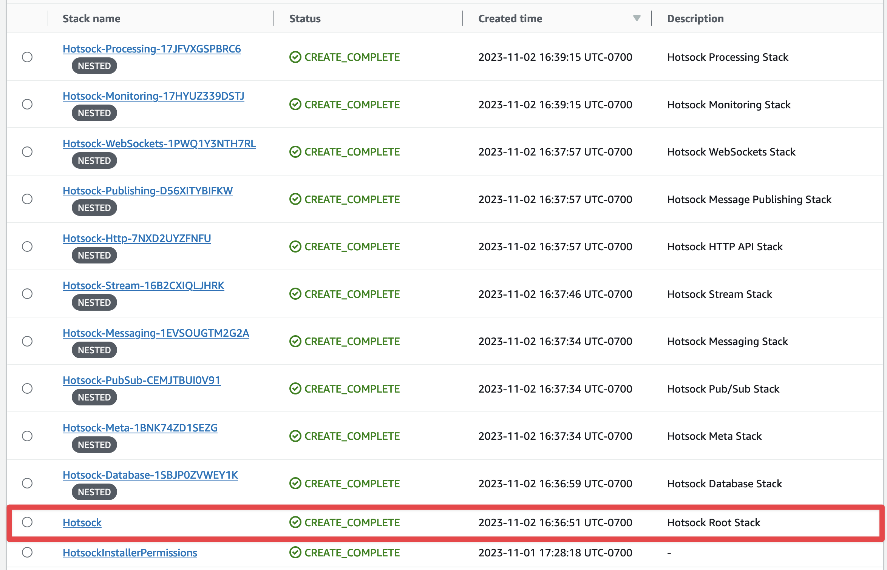

During the creation process it will create and connect [a lot of resources](#aws-services) in your account.

Once the stack creation completes, installation was successful. Next you'll likely want to [configure Authentication](../connections/authentication.mdx).

## Stack outputs and endpoints

Upon successful creation of your Hotsock stack, the root CloudFormation stack has an "Outputs" tab with a list of variables specific to your installation.

:::info Example Stack Outputs Values
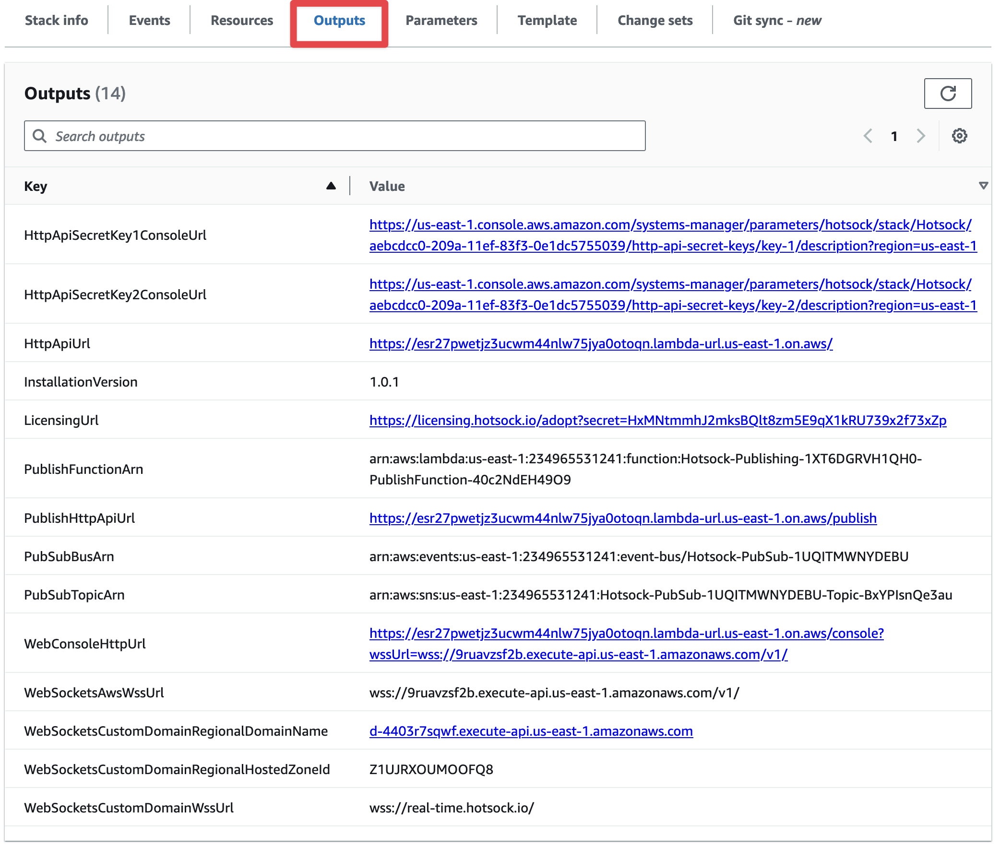
:::

### HttpApiSecretKey1ConsoleUrl {#HttpApiSecretKey1ConsoleUrl}

This is the URL where you can find the primary secret key value for API calls to the `PublishHttpApiUrl`. To access the secret value, go to this URL and click the "Show" link by the "Value" label, which will reveal a 40-character secret key that must be used as a Bearer token in the Authorization header of all HTTP API requests.

:::info Example Output Value
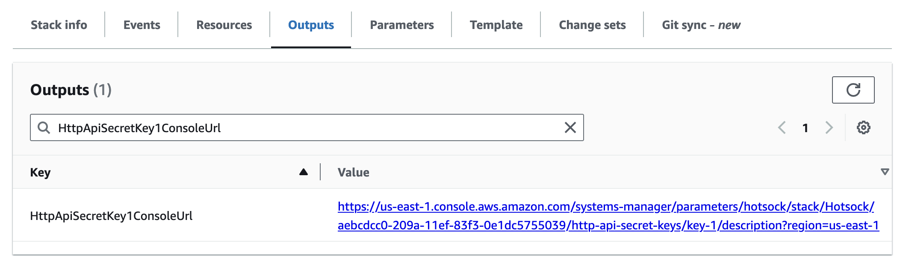
:::

### HttpApiSecretKey2ConsoleUrl {#HttpApiSecretKey2ConsoleUrl}

This is the URL where you can find the secondary secret key value for API calls to the `PublishHttpApiUrl`. To access the secret value, go to this URL and click the "Show" link by the "Value" label, which will reveal a 40-character secret key that must be used as a Bearer token in the Authorization header of all HTTP API requests.

This secondary key exists to allow for zero-downtime secret key rotation. You can always use either key. If you want to allow access from more API keys, you can add additional keys to Parameter Store in the `/hotsock/hotsock/90592770-5584-11ee-b651-0ad7a5b44125/http-api-secret-keys` namespace.

:::info Example Output Value
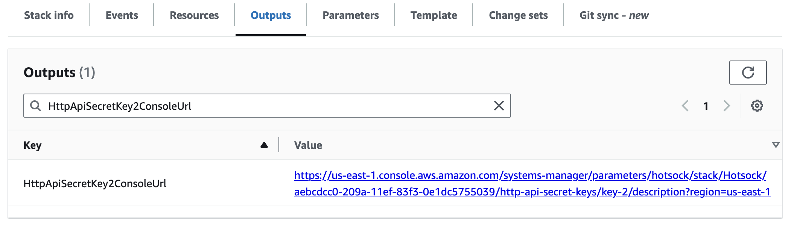
:::

### HttpApiUrl {#HttpApiUrl}

This is the base URL for all HTTP API endpoints.

:::info Example Output Value
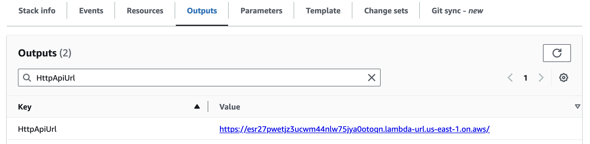
:::

### InstallationVersion {#InstallationVersion}

This is the version of this installation.

:::info Example Output Value
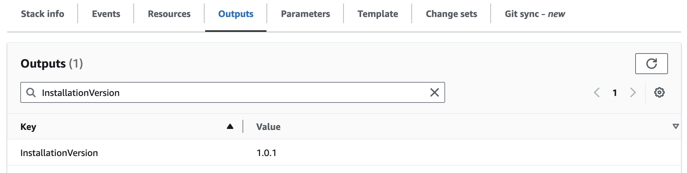
:::

### LicensingUrl {#LicensingUrl}

Installations are initially configured with [Free Tier](../licensing/pricing.mdx#free-tier) licensing. Follow this URL to adopt the installation as part of a [Paid Tier upgrade](../licensing/paid-tier-upgrade.mdx) or to manage this installation's license if already adopted.

If this URL's value is blank, the installation is already adopted by a Hotsock account holder but a direct management URL is not available.

:::info Example Output Value
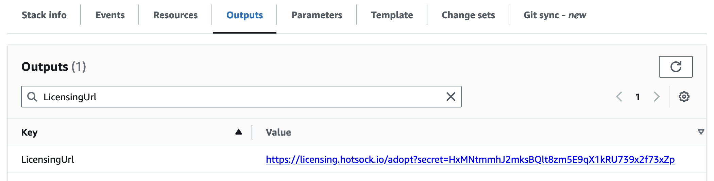
:::

### MonitoringOverviewDashboardUrl {#MonitoringOverviewDashboardUrl}

The URL of a CloudWatch Dashboard that combines important metrics about your installation in a single place.

:::info Example Output Value

:::

### PublishFunctionArn {#PublishFunctionArn}

This is the Arn of the Lambda function that your backend systems can use to publish messages using the AWS SDK or from other AWS services (such as EventBridge). This is the recommended way to publish messages from your backend systems.

:::info Example Output Value
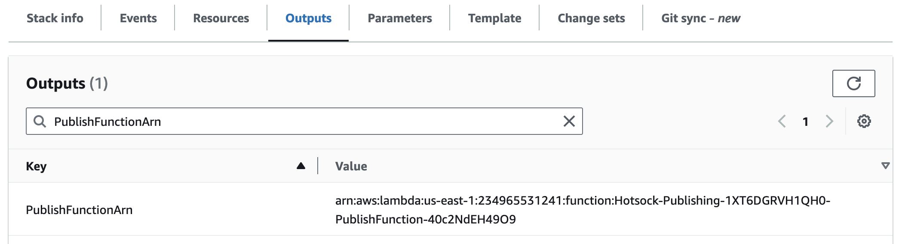
:::

### PublishHttpApiUrl {#PublishHttpApiUrl}

This is the URL that your backend systems uses to publish messages if using HTTP with static API keys.

:::info Example Output Value
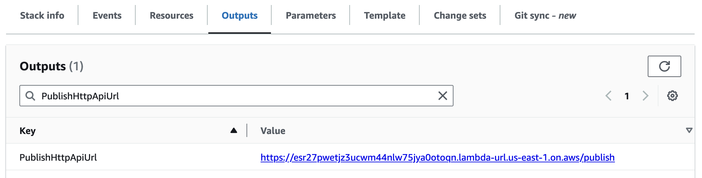
:::

### PubSubBusArn {#PubSubBusArn}

This is the Amazon Resource Name (Arn) for the EventBridge event bus that is used for messages published via [pub/sub](../server-api/events.mdx).

:::info Example Output Value
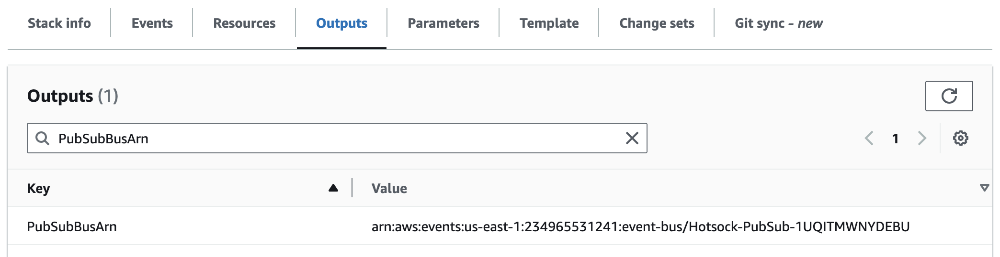
:::

### PubSubTopicArn {#PubSubTopicArn}

This is the Amazon Resource Name (Arn) for the SNS topic used for messages published via [pub/sub](../server-api/events.mdx).

:::info Example Output Value
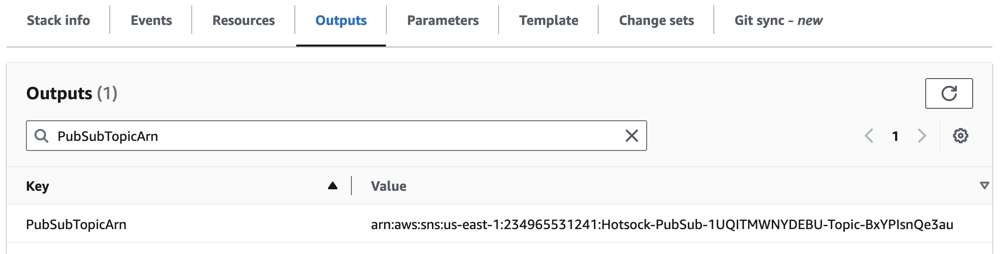
:::

### WebConsoleHttpUrl {#WebConsoleHttpUrl}

This is a link to your installation's web console where you can debug and test WebSocket auth tokens, connections, subscriptions, and messages.

This URL is public by design. It's a static HTML page that contains no resources that need protection. The `wssUrl` parameter in the URL tells the page where to make WebSocket connections.

:::info Example Output Value
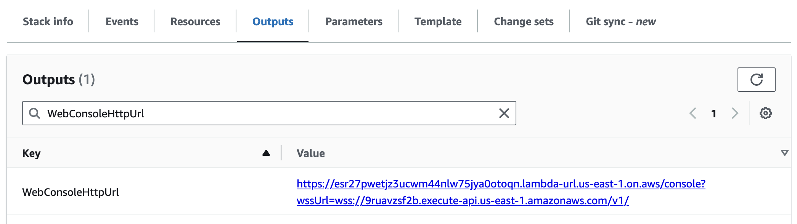
:::

### WebSocketsAwsWssUrl {#WebSocketsAwsWssUrl}

This is the URL that your clients will use when making WebSocket connections. This URL remains functional regardless of custom domain settings.

:::info Example Output Value
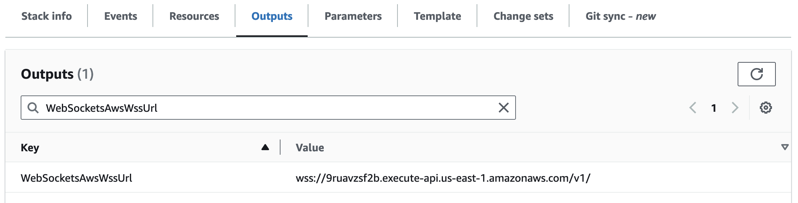
:::

### WebSocketsCustomDomainRegionalDomainName {#WebSocketsCustomDomainRegionalDomainName}

If you've enabled a custom domain for your WebSockets endpoint, this is the value that your CNAME or ALIAS record must point to when configuring DNS. See the [custom domains](./custom-domains.mdx) documentation for more details.

This value is blank if a custom domain is not configured.

:::info Example Output Value
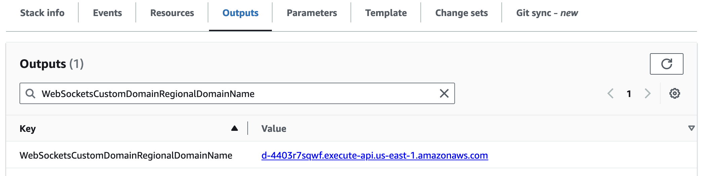
:::

### WebSocketsCustomDomainRegionalHostedZoneId {#WebSocketsCustomDomainRegionalHostedZoneId}

If you've enabled a custom domain for your WebSockets endpoint, this is the AWS Hosted Zone ID that must be used if configuring an ALIAS record in Route53. This is not needed for a CNAME. See the [custom domains](./custom-domains.mdx) documentation for more details.

This value is blank if a custom domain is not configured.

:::info Example Output Value
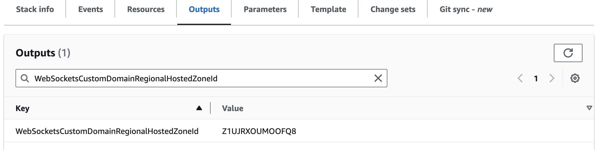
:::

### WebSocketsCustomDomainWssUrl {#WebSocketsCustomDomainWssUrl}

If you've enabled a custom domain for your WebSockets endpoint, this is the URL that your clients can use when making WebSocket connections (in place of [WebSocketsAwsWssUrl](#WebSocketsAwsWssUrl)).

This value is blank if a custom domain is not configured.

:::info Example Output Value
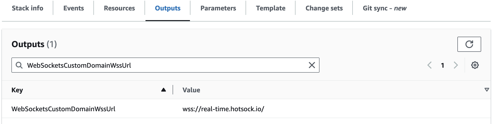
:::

## AWS Services

A Hotsock installation configures several AWS resources in your account. This list may not be comprehensive, but should paint the majority of the picture.

Hotsock aims to use exclusively Serverless services in the purest sense of the word. Running an idle installation of Hotsock shouldn't cost you anything and you shouldn't need to turn any knobs to scale up or down.

### API Gateway WebSockets

This service manages the WebSocket connections to your clients. Messages are sent to connected clients with Lambda and messages received by connected clients are passed to Lambda by API Gateway.

### Lambda

All logic is run in Lambda using functions written in Go using the `provided.al2023` (Amazon Linux 2023) runtime on `arm64` (Graviton2). It's wicked fast and stable. The best language on the best runtime. :)

Lambda is also the entry-point for all backend-initated messages. It then immediately passes those messages to SQS for further processing.

### DynamoDB & DynamoDB Streams

Any data that needs to be persisted - connection information, channel subscriptions, etc. - is stored in DynamoDB. Hotsock makes an effort to keep the database lean by expiring/deleting most items once they are no longer needed.

As things are written to the table, changes are sent via DynamoDB Streams to a Lambda function that can act on them and often publish them as events to SNS and/or EventBridge.

### Simple Queue Service (SQS)

SQS acts as a buffer for all messages as they arrive. It keeps messages in order and allows them to be processed in batches if they're coming in fast enough.

### Simple Notification Service (SNS)

Things that happen (events) in Hotsock are published to SNS and subscribed to by listeners who care about specific types of events (often other Lambda functions). SNS is also used for all Hotsock-internal events.

### EventBridge

Things that happen (events) in Hotsock can optionally be [published to EventBridge](../server-api/events.mdx) and subscribed to by various listeners in your applications or by [other AWS services](https://docs.aws.amazon.com/eventbridge/latest/userguide/eb-targets.html). You can also use EventBridge [API Destinations](https://docs.aws.amazon.com/eventbridge/latest/userguide/eb-api-destinations.html) to send events as webhooks to any HTTP endpoint you wish based on event rules and can transform the request shape to match your target systems.

### Systems Manager Parameter Store

If you're using HTTP to publish messages from your backend, the (secret) API keys are stored here.

### CloudWatch

All the logs go here for debugging and you can keep an eye on the health of the stack using metrics, alarms, and dashboards.
