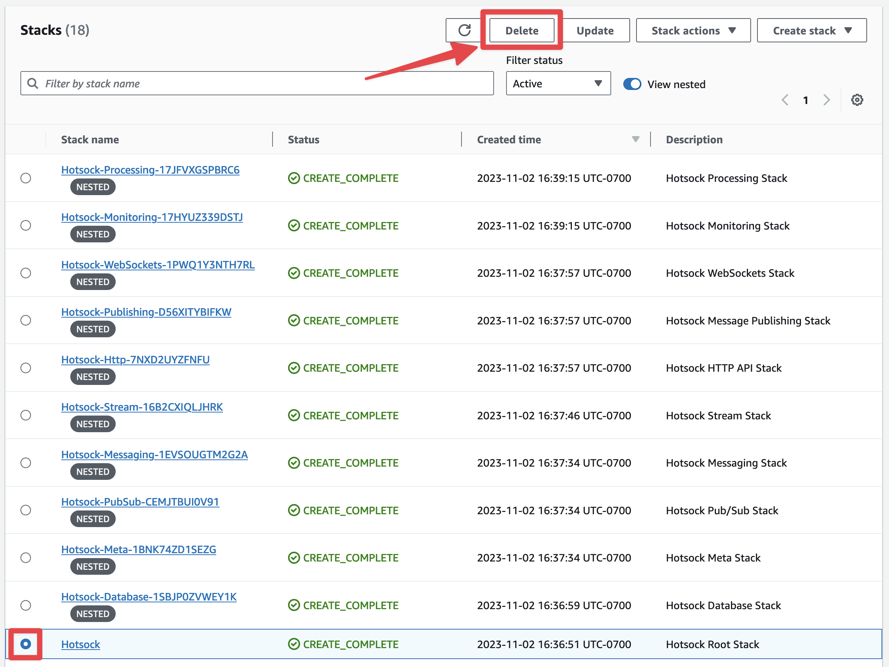
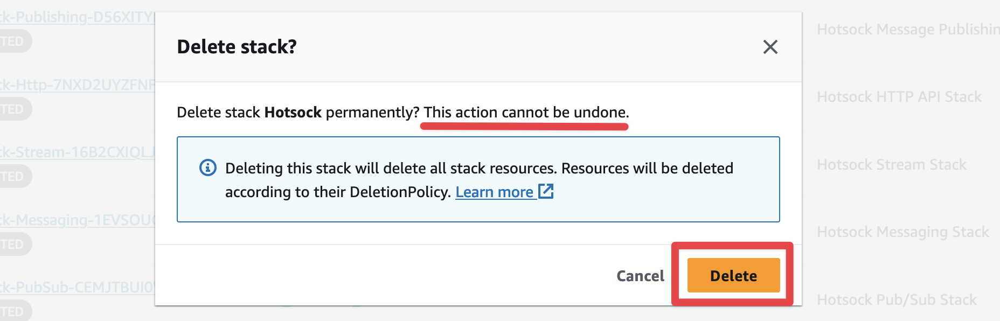
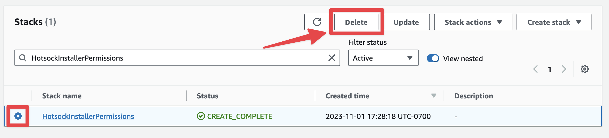
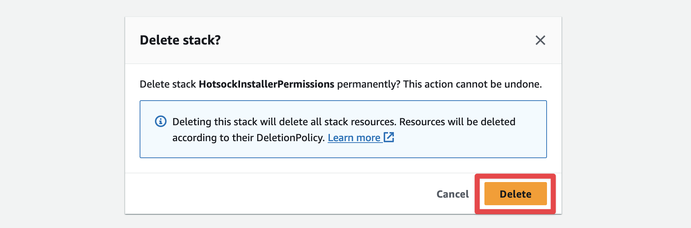

# Uninstall Hotsock 🗑️

Want to remove your Hotsock installation? No problem. Doing so takes about 5 minutes.

:::danger
This process is irreversible. The underlying resources as well as the backend and client-facing URLs generated by AWS during installation cannot be restored. Proceed with caution.
:::

## Main Stack Removal

The following will delete all resources in your AWS account that make up your Hotsock installation.

Open the [CloudFormation service console](https://console.aws.amazon.com/cloudformation/home) and switch to the region where Hotsock is installed using the region switcher in the top-right navigation.

In the list of CloudFormation stacks, find your `Hotsock` root stack. There are many Hotsock stacks marked as "nested", you'll want to ignore those and find the root stack that is _not_ marked as nested.

Click on the stack and choose the "Delete" action button in the upper right.

Confirm deletion in the pop-up.

Deletion takes a few minutes and will tear down all resources created by Hotsock, including the nested stacks.

## Installation Permissions Stack Removal

The following will permanently delete the installer permissions IAM roles and policies.

:::warning
Do not begin the deletion of the `HotsockInstallerPermissions` stack until the main `Hotsock` stack has finished deleting or you'll encounter permission errors during the main stack's deletion attempt.
:::

Open the [CloudFormation service console](https://console.aws.amazon.com/cloudformation/home) and switch to the region where Hotsock is installed using the region switcher in the top-right navigation.

In the list of CloudFormation stacks, find your `HotsockInstallerPermissions` stack. Click on the stack and choose the "Delete" action button in the upper right.

Confirm deletion in the pop-up.

If you got this far and care to share more about why things didn't work out, get in touch at support@hotsock.io. Feedback is always welcome.
