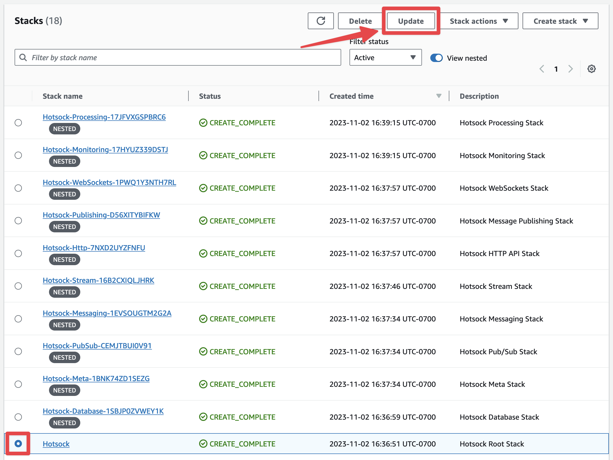
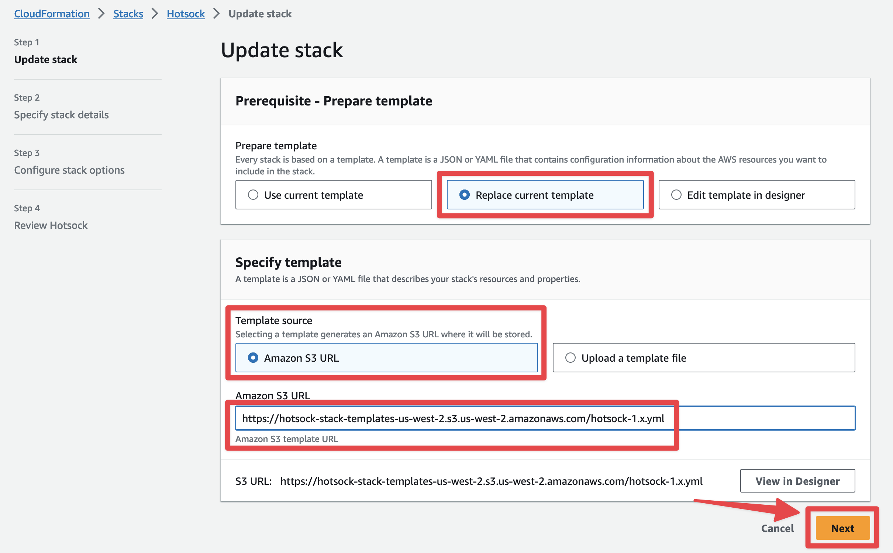

# Update Your Installation ⬆️

You can update your existing Hotsock CloudFormation stack to the latest Hotsock version in-place at any time without affecting currently-connected clients. You can generally [expect full compatibility](./versioning.mdx) with existing applications, but feel free to test updates against an isolated pre-production installation to ensure there aren't any issues.

Updates typically take 5 minutes or less.

## Automatic updates

By default, installations auto-update daily sometime between 08:00-08:59 UTC. This can be configured by setting the CloudFormation "Automatically update installation" (`AutoUpdateInstallationParameter` via CLI) to `enabled` or `disabled`.

To change the time of day that updates run, set the CloudFormation "Auto-update hour of each day (UTC)" (`AutoUpdateUTCHourParameter` via CLI) to the desired hour. Although the performance impact of running updates is minimal, it's best to choose a low-traffic time of day.

## Manually update CloudFormation stack

If [automatic updates](#automatic-updates) are disabled, you can update your installation to the latest version or to a specific version by running a manual update to the CloudFormation stack.

Sign into your AWS account as a principal with administrative permissions and open the CloudFormation console. Find the root Hotsock stack and click on its radio button. There are many Hotsock stacks marked as "nested", you'll want to ignore those and find the root stack that is _not_ marked as nested.

In the upper-right, click the "Update" button. Conveniently, if you accidentally try and update a nested stack, it will suggest that you instead go to the root stack.

On the "Prerequisite - Prepare template" screen, choose "Replace current template" option.

Keep "Template source" set to "Amazon S3 URL" and find the template URL from the table below for your installation's region and copy it into the "Amazon S3 URL" input field. Then click "Next".

| Region                    | Alias          | Template URL                                                                                    |
| ------------------------- | -------------- | ----------------------------------------------------------------------------------------------- |
| US East (N. Virginia)     | us-east-1      | https://hotsock-stack-templates-us-east-1.s3.us-east-1.amazonaws.com/hotsock-v1.x.yml           |
| US East (Ohio)            | us-east-2      | https://hotsock-stack-templates-us-east-2.s3.us-east-2.amazonaws.com/hotsock-v1.x.yml           |
| US West (N. California)   | us-west-1      | https://hotsock-stack-templates-us-west-1.s3.us-west-1.amazonaws.com/hotsock-v1.x.yml           |
| US West (Oregon)          | us-west-2      | https://hotsock-stack-templates-us-west-2.s3.us-west-2.amazonaws.com/hotsock-v1.x.yml           |
| Africa (Cape Town)        | af-south-1     | https://hotsock-stack-templates-af-south-1.s3.af-south-1.amazonaws.com/hotsock-v1.x.yml         |
| Asia Pacific (Hong Kong)  | ap-east-1      | https://hotsock-stack-templates-ap-east-1.s3.ap-east-1.amazonaws.com/hotsock-v1.x.yml           |
| Asia Pacific (Mumbai)     | ap-south-1     | https://hotsock-stack-templates-ap-south-1.s3.ap-south-1.amazonaws.com/hotsock-v1.x.yml         |
| Asia Pacific (Osaka)      | ap-northeast-3 | https://hotsock-stack-templates-ap-northeast-3.s3.ap-northeast-3.amazonaws.com/hotsock-v1.x.yml |
| Asia Pacific (Seoul)      | ap-northeast-2 | https://hotsock-stack-templates-ap-northeast-2.s3.ap-northeast-2.amazonaws.com/hotsock-v1.x.yml |
| Asia Pacific (Singapore)  | ap-southeast-1 | https://hotsock-stack-templates-ap-southeast-1.s3.ap-southeast-1.amazonaws.com/hotsock-v1.x.yml |
| Asia Pacific (Sydney)     | ap-southeast-2 | https://hotsock-stack-templates-ap-southeast-2.s3.ap-southeast-2.amazonaws.com/hotsock-v1.x.yml |
| Asia Pacific (Tokyo)      | ap-northeast-1 | https://hotsock-stack-templates-ap-northeast-1.s3.ap-northeast-1.amazonaws.com/hotsock-v1.x.yml |
| Canada (Central)          | ca-central-1   | https://hotsock-stack-templates-ca-central-1.s3.ca-central-1.amazonaws.com/hotsock-v1.x.yml     |
| Europe (Frankfurt)        | eu-central-1   | https://hotsock-stack-templates-eu-central-1.s3.eu-central-1.amazonaws.com/hotsock-v1.x.yml     |
| Europe (Ireland)          | eu-west-1      | https://hotsock-stack-templates-eu-west-1.s3.eu-west-1.amazonaws.com/hotsock-v1.x.yml           |
| Europe (London)           | eu-west-2      | https://hotsock-stack-templates-eu-west-2.s3.eu-west-2.amazonaws.com/hotsock-v1.x.yml           |
| Europe (Milan)            | eu-south-1     | https://hotsock-stack-templates-eu-south-1.s3.eu-south-1.amazonaws.com/hotsock-v1.x.yml         |
| Europe (Paris)            | eu-west-3      | https://hotsock-stack-templates-eu-west-3.s3.eu-west-3.amazonaws.com/hotsock-v1.x.yml           |
| Europe (Stockholm)        | eu-north-1     | https://hotsock-stack-templates-eu-north-1.s3.eu-north-1.amazonaws.com/hotsock-v1.x.yml         |
| Middle East (Bahrain)     | me-south-1     | https://hotsock-stack-templates-me-south-1.s3.me-south-1.amazonaws.com/hotsock-v1.x.yml         |
| South America (Sao Paulo) | sa-east-1      | https://hotsock-stack-templates-sa-east-1.s3.sa-east-1.amazonaws.com/hotsock-v1.x.yml           |

:::info
The URLs in the table above cannot be accessed directly from your browser - you'll get an `AccessDenied` error if you try. This is by design - they are only meant to be accessed from within AWS by AWS services. CloudFormation accepts them as valid template URLs during installation.
:::

1. Scroll to the bottom of the "Specify stack details" screen and click "Next".
1. Scroll to the bottom of the "Configure stack options" screen and click "Next".
1. Scroll to the bottom of the "Review Hotsock" screen, check all the boxes in the "Capabilities and transforms" section and click "Submit".

The stack should have the status `UPDATE_COMPLETE` within a few minutes. Your installation is now up-to-date.
