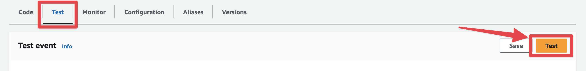
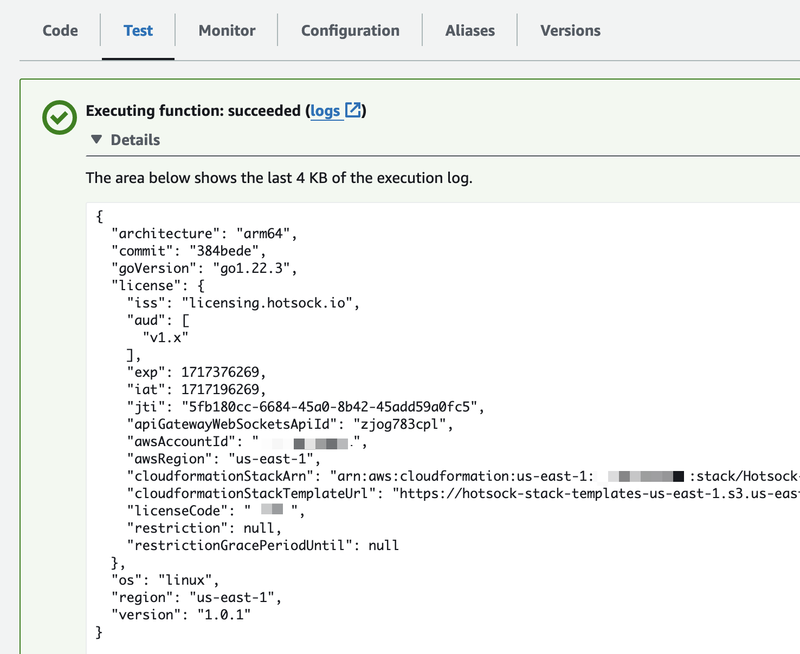

# Hotsock Compatibility & Versioning

**Stability is paramount.** You can have the following expectations when evaluating Hotsock and planning for the future.

## Expectations

- Hotsock is built on "forever APIs" and services provided by AWS. If history is any indication, the APIs of the underlying AWS services do not change. Tangental service and permissions deprecations do happen from time to time, and we'll be in contact with licensed account owners if API deprecations affect Hotsock installations.
- There are no long-running processes that ever need to be restarted and there are no backing services that require scheduled maintenance. In the case of AWS issues and outages, Hotsock installations are self-healing &mdash; service will be fully restored upon restoration of the backing AWS service(s).
- A Hotsock v1.x installation can run without any maintenance for a very long time (years). Periodic updates are recommended to ensure you stay up-to-date with the latest security patches and bug fixes, but this is not required to keep things running. Automatic updates are included and enabled by default.
- Updates should not break behavior for existing applications. Exceptions may be made on a case-by-case basis when underlying code depends on a security vulnerability or a clear bug. In such rare cases, this will be clearly communicated to license holders.
- Updates keep existing WebSocket connections alive and messages continue to be processed while changes are applied.
- JWT signing keys and backend Hotsock API keys can be rotated as needed with zero downtime.
- Future compatibility is based on the behavior and interfaces detailed in the documentation. Hotsock-internal SNS events may be changed at any time without a major version bump (internal events are published to a separate topic from documented [pub/sub events](../server-api/events.mdx)).
- AWS Lambda runtime changes and other AWS service configuration updates may be included in minor version updates, as long as the changes do not cause resources to be replaced or break existing behavior.
- Log entries written to CloudWatch Logs are not considered public API and their keys/values or shape may change between minor versions. If you find yourself attaching metric filters or getting fancy with logs insights, get in touch &mdash; I'd love to hear the use case.

## Determine your current version

All installations include a Lambda function that you can run manually to return current version and license information. This is particularly useful when [contacting support](mailto:support@hotsock.io) to help with debugging.

Open the AWS console to Lambda and search for the function that contains the name `InstallationInfoFunction`. Click on the function to view its details.

Example: `Hotsock-Meta-8LWCHQA35HF4-InstallationInfoFunction-ineJezMzbD8B`

Scroll down a bit and click the "Test" tab. Then click the "Test" button to run the function. The default event JSON can be submitted as-is, as all input is ignored.

You should see "Executing function: succeeded" in a green box. Expand the details to see the installation info and version. The output should look something like the following.

