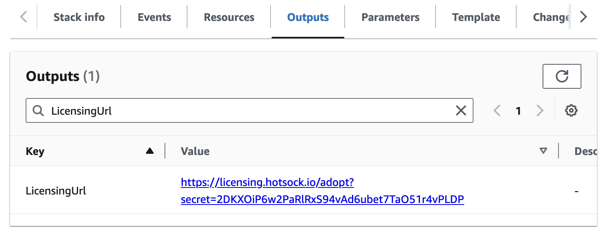

# Paid Tier Upgrade

New installations start with unlimited Free Tier access. This is great for evaluating Hotsock or for use in small-scale hobby applications, but for production applications the Paid Tier ensures continued operation of the service beyond Free Tier limits.

## Adopt An Installation

To switch an installation from the Free Tier to the Paid Tier, it must be adopted by its paying owner.

After running [Initial Setup](../installation/initial-setup.mdx), you can access the installation's [LicensingUrl](../installation/initial-setup.mdx#LicensingUrl) from the main CloudFormation stack's outputs.

Open this URL in a web browser and follow the instructions to configure billing for this installation and complete installation adoption. Once complete, the installation will be on the Paid Tier with its messaging limits removed immediately.

:::tip
**Adoption occurs automatically if the AWS account or AWS Organization has previously adopted an installation and is already licensed for the Paid Tier.**

If your `LicensingUrl` is empty, it means that the installation is already adopted by an owner.
:::
