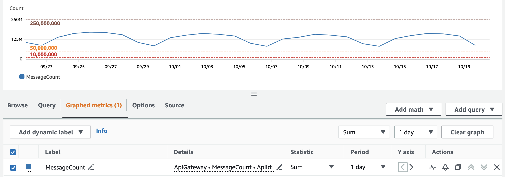

# Hostock Pricing

Start for free, then pay as you grow.

## Free Tier

New installations are granted Free Tier access forever, which includes all features but has the following limits:

- Usage is hard-capped at 1 million free WebSockets messages per calendar month across all installations in an AWS account or AWS organization.
- Unlimited installations in a single AWS account in a single region.
- If your AWS account is a member of an AWS Organization, installations can only be created in a single AWS account within that organization.
- Support is limited.

To ensure your installations operate uninterrupted and scale beyond the Free Tier to any number of messages, AWS accounts, and AWS regions, choose one of our flexible Paid Tier options.

## Paid Tier

Paid Tier pricing scales with your usage. Both pay-as-you-go and baseline allowance licensing is available. See the pricing table below for details.

|                Price                 |                       Included messages per month                       |     AWS Configuration     |            Support            |
| :----------------------------------: | :---------------------------------------------------------------------: | :-----------------------: | :---------------------------: |
|    **$1.25 per million messages**    |         1 million free messages each month, then pay as you go          |    1 account, 1 region    | [Standard](#standard-support) |
|   **$99/month** or **$1,069/year**   | 300 million (~10 million per day)   _$0.50 per additional million_  |    1 account, 1 region    | [Standard](#standard-support) |
|  **$299/month** or **$3,229/year**   | 1.5 billion (~50 million per day)   _$0.45 per additional million_  |   5 accounts, 2 regions   |  [Premium](#premium-support)  |
|  **$599/month** or **$6,469/year**   | 7.5 billion (~250 million per day)   _$0.40 per additional million_ |  25 accounts, 5 regions   |  [Premium](#premium-support)  |
| **$1,299/month** or **$14,029/year** |  30 billion (~1 billion per day)   _$0.35 per additional million_   | 100 accounts, all regions |  [Premium](#premium-support)  |
| **$2,799/month** or **$30,229/year** |  150 billion (~5 billion per day)   _$0.30 per additional million_  | 500 accounts, all regions |  [Premium](#premium-support)  |

Need to send more messages, have a unique situation, or have questions about billing? Email support@hotsock.io.

All plans support an unlimited number of installations. This allows configuring development or staging environments as needed (within the AWS account and region parameters for your pricing plan). You can also [create multiple installations for tenant isolation or scaling reasons](../performance/limits-and-scaling.mdx#multiple-installations) if that meets your use case.

:::info
All pricing information listed is for Hotsock licensing only. **It does not include any AWS infrastructure costs for running your installations.** AWS pricing can be found on each AWS service's pricing page.
:::

## Standard Support

Standard support provides quick, business hours email support where we can provide general guidance for issues. General guidance will help you work through most issues, but does not get into the nitty gritty of your specific installation.

## Premium Support

Premium support provides quick, business hours email support where we can provide contextual use-case and application-specific guidance for your installations. Premium support also includes us being able to [assume a support role in your account](./support.mdx#assume-role-in-your-account) when necessary for us to gain further insight into your issues.

## FAQs

### How are messages counted for billing purposes?

We read the `AWS/ApiGateway/MessageCount` [CloudWatch metric](https://docs.aws.amazon.com/AmazonCloudWatch/latest/monitoring/working_with_metrics.html) specific to the WebSocket API created by your installation(s) to calculate usage from your AWS account(s). This is done by periodically assuming the `HotsockLicensingRole` that is configured during installation. License updates will begin to fail if our permission to access usage metrics is revoked.

The example account below sends ~170M messages per day (~5.2 billion per month) and would fit in the 7.5 billion messages per month (~250 million per day) plan.

### What happens if I go over the plan's message count?

Paid Tier plans have a baseline monthly allocation as well as an overage price billed per one million messages. After you use your baseline allocation for the month, you're billed per million messages after that until your billing cycle renews. This allows you to handle temporary spikes in message volume or remain on your current plan as long as you like.

There are **never any hard license-imposed limits** that will suddenly or unexpectedly affect your application as long as you have a valid Paid Tier license tied to an account in good standing.

Free Tier installations stop functioning once they use 1 million messages in a given month. Service is restored at the beginning of the next billing cycle. [Upgrade to pay-as-you-go](./paid-tier-upgrade.mdx) to remove this hard limit.

### Can I distribute Hotsock to my customers?

Each license allows for use across a specific number of AWS accounts. You can configure Hotsock installations in your customers' AWS accounts or in AWS accounts you maintain on behalf of your customers as long as **each installation in your customer accounts are only used as part of your application. You may not resell Hotsock as a standalone service.**
