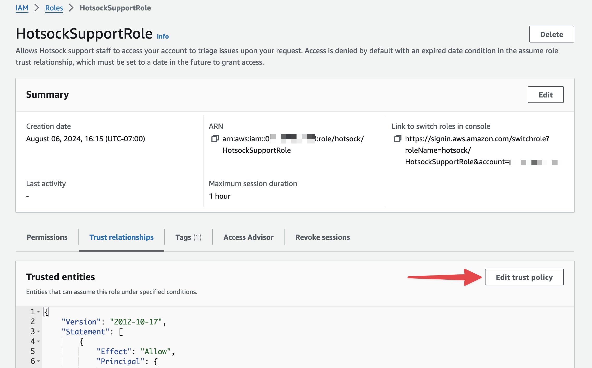
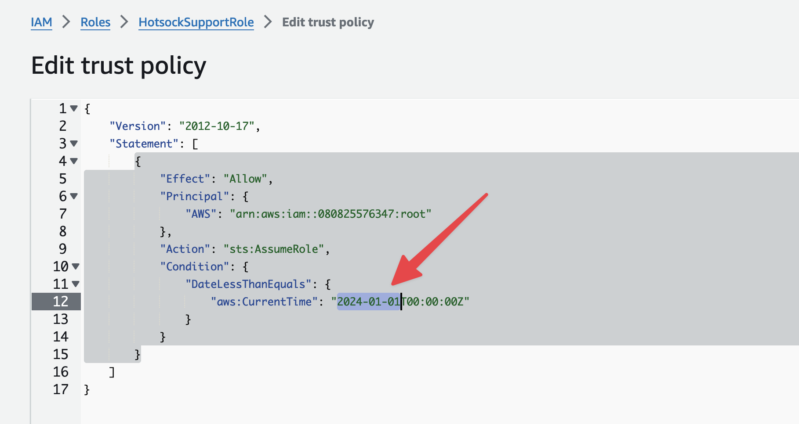

# Getting Support

All [Paid Tier](./pricing.mdx#paid-tier) customers have access to support via email. We like to keep it simple - send an email to support@hotsock.io from the email address associated with your [licensing account](https://licensing.hotsock.io).

Please do not include sensitive information such as API keys or credentials in a support email.

## Assume Role In Your Account

Higher-tier plans with Premium support can get installation-specific support from inside your account, if requested.

For cases where we're unable to reproduce your issue or you need our assistance within your AWS account, you can temporary grant us permissions to assume the `HotsockSupportRole` in your account. Our permissions are denied by default because of a "DateLessThanEquals" "aws:CurrentTime" condition being set to a date in the past.

:::danger
Although we have no intention of spelunking through your data, enabling this role does make it possible for us to access data in your account. This role requires broad access so we can troubleshoot issues this way when necessary.
:::

Search for "HotsockSupportRole" in the [IAM Console](https://console.aws.amazon.com/iam/home#/roles)

To allow us to temporarily access your account via this role, change this date to a date in the future (YYYY-MM-DD) format. We generally recommend setting this to a timestamp ~10 days in the future. You can always extend it if we need more time.

Save these changes and let us know via email so we can work your issue.
