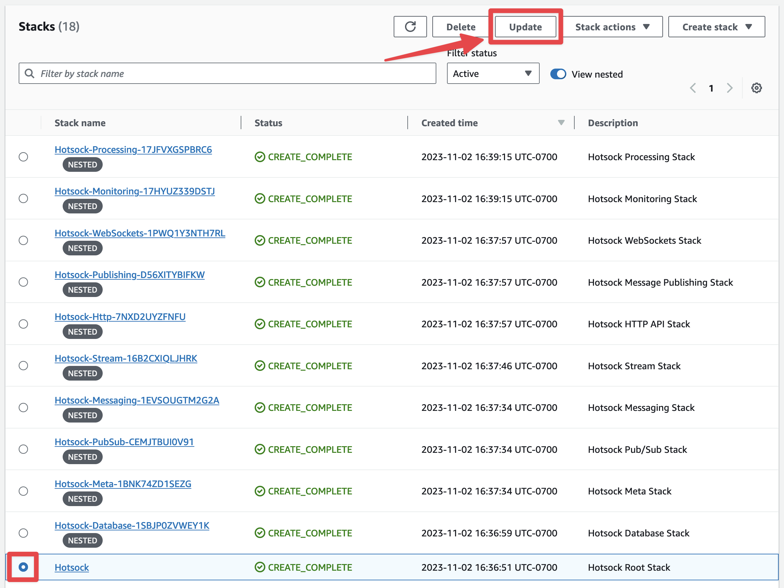
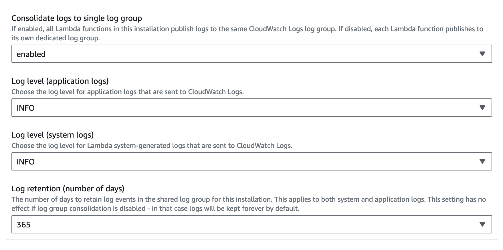

# Logging 🪵

Hotsock logs are written to [CloudWatch Logs](https://docs.aws.amazon.com/AmazonCloudWatch/latest/logs/WhatIsCloudWatchLogs.html). By default, it writes informational info, warnings, and errors to logs. However, you have full control over the log volume, verbosity, and retention settings in your installation's settings.

## Consolidated logging & retention

By default, all application logs from Lambda functions are written to the same CloudWatch Logs log group. This aggregates all log entries to one place for searching or following in real-time.

Consolidated logging also allows configuring a log retention policy for these logs so you're not paying for their storage forever. Log retention defaults to 365 days (1 year), but you can [change this in your installation's settings](#change-log-settings).

## System log settings

System logs are the logs that the Lambda service generates. These logs indicate the timing of when a Lambda function was invoked, how long it took, etc. There are 3 available log levels for system logs.

- `DEBUG`: Detailed information for system debugging.
- `INFO`: Messages that record the normal operation of functions.
- `WARN` (default): Messages about errors that may have caused or may lead to unexpected behavior if unaddressed.

Learn more about Lambda logging controls [in the official documentation](https://docs.aws.amazon.com/lambda/latest/dg/monitoring-cloudwatchlogs.html).

## Application log settings

This default log level is the "INFO" level. There are 4 log levels available. A given log level includes all logs from the levels below it.

- `DEBUG`: Extremely verbose, attempts to log all user input data as well as all inputs and relevant outputs from AWS services. Includes INFO, WARN, and ERROR logs.
- `INFO` (default): Limited verbosity informational logs. Includes WARN and ERROR logs.
- `WARN`: Improper use of inputs, deprecation warnings, etc. Includes ERROR logs.
- `ERROR`: Unexpected errors that likely could not be recovered.

To minimize log volume while retaining important messages, `WARN` is a reasonable choice for high-throughput production installations. If you configure an installation for a development or staging environment, "DEBUG" can be a good choice so you can follow individual requests through Hotsock.

:::warning
The `DEBUG` log level can incur significant costs on large-scale installations. Consider using this log level temporarily to capture logs for a given situation, then restore the setting to one of the less verbose log levels.

Additionally, the `DEBUG` level logs all messages as they are received and published, including the payloads. These entries may contain sensitive information. Be sure to review your CloudWatch Logs permissions and retention settings if you're enabling `DEBUG` loging for a production workload.
:::

## Change log settings

Sign into your AWS account as a principal with administrative permissions and open the CloudFormation console. Find the root Hotsock stack and click on its radio button. There are many Hotsock stacks marked as "nested", you'll want to ignore those and find the root stack that is _not_ marked as nested.

In the upper-right, click the "Update" button. Conveniently, if you accidentally try and update a nested stack, it will suggest that you instead go to the root stack.

You'll be prompted with the "Prepare template" screen and can keep "Use current template" selected and click "Next".

On the "Specify stack details" screen, you can configure **"Consolidate logs to single log group"**, **"Log level (application logs)"**, **"Log level (system logs)"**, and **"Log retention (number of days)"**.

Once you're satisfied with your choices, you can update the stack with these new settings.

1. Scroll to the bottom and click "Next".
1. Scroll to the bottom of the "Configure stack options" screen and click "Next".
1. Scroll to the bottom of the "Review Hotsock" screen, check all the boxes in the "Capabilities and transforms" section and click "Submit".

The setting is applied immediately and logging changes will apply as soon as the stack update completes.
