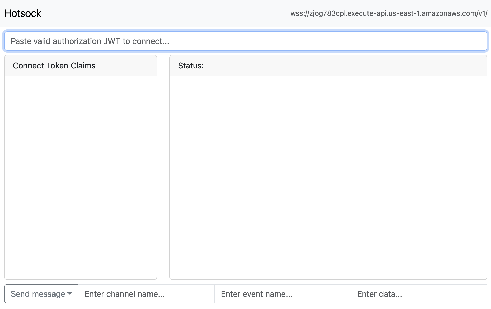
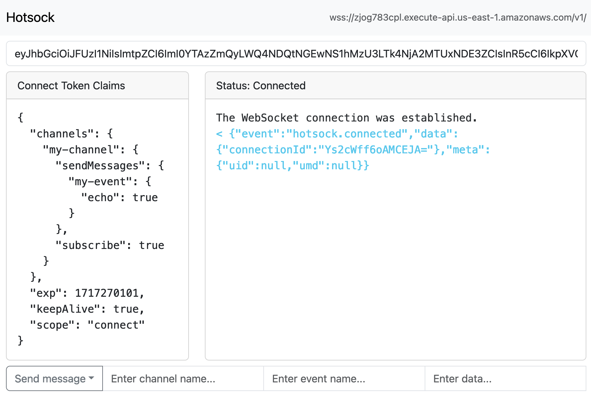
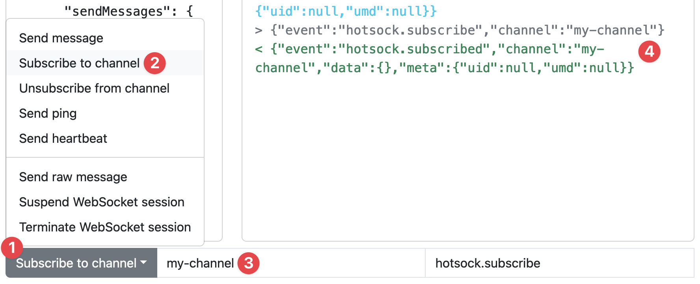
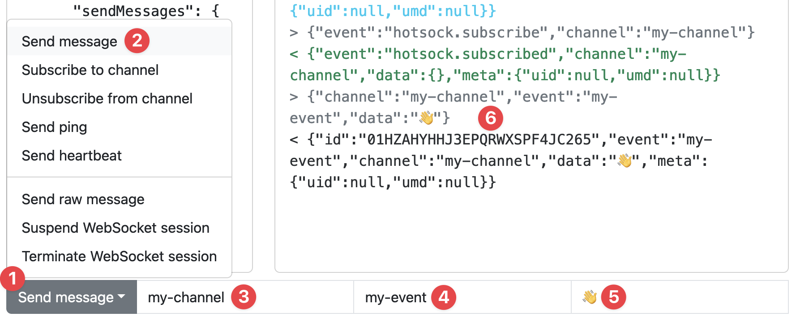

# Web Console

Each installation includes a web-based console, which is designed to help you debug and test JWT validation, token claims, connections, channel subscriptions, and messages. The web console uses [hotsock-js](https://github.com/hotsock/hotsock-js) under-the-hood.

The URL for your installation's web console can be found in your CloudFormation stack's [`WebConsoleHttpUrl`](../installation/initial-setup.mdx#WebConsoleHttpUrl) output.

Open the URL, and you'll see your web console.

## Connect to the WebSocket

Using the JWT issuer configured for your installation, issue yourself a valid token with the [`connect` scope](../connections/claims.mdx#scope).

Paste the token in the input on top. The token is parsed so you can see what claims were included. The console will automatically attempt to establish a connection using that token. If all goes well, you're connected.

## Subscribe

The permissions in the example token allow subscribing to `my-channel`.

To subscribe to the channel, click the dropdown menu at the bottom, choose "Subscribe to channel", enter "my-channel" in the channel name input, and hit Enter/Return on your keyboard.

You'll see an outgoing WebSocket message that requests the subscription followed by an incoming WebSocket message that confirms this connection is successfully subscribed.

You can [publish messages](./publish-messages.mdx) from your backend to the `my-channel` channel and you'll see a copy of those messages as they're received in real-time.

## Send message

The permissions in the example token allow publishing messages in `my-channel` that have the event `my-event`.

To send a message, click the dropdown menu at the bottom, choose "Send message", enter "my-channel" in the channel name input, enter "my-event" in the event name input, and any value in the data input. Then hit Enter/Return on your keyboard.

You'll see an outgoing WebSocket message that sends the message on the channel. Any other channel subscribers will receive this message, and because the claim has [`echo`](../connections/claims.mdx#echo) enabled for this event, the sending connection also receives a copy of the message.

## Other actions

You can also use the web console to unsubscribe from channels, send pings and heartbeats, test disconnect/reconnect, and test sending your own raw messages on the WebSocket. Use the dropdown menu at the bottom to select the action you need.
